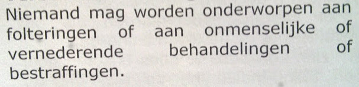

####
MEDS
####

.. include:: README.rst

AUTHOR
======

| Bart Thate - 48 jaar
| IRC: botfather on #dunkbots irc.freenode.net
| email: bthate@dds.nl, thatebart@gmail.com
| http://pypi.python.org/pypi/meds
| http://pikacode.com/bart/meds

CODE
====

.. autosummary::
    :toctree: code
    :template: module.rst

    meds.cfg
    meds.defines
    meds.errors
    meds.event
    meds.log
    meds.misc
    meds.object
    meds.opts
    meds.scheduler
    meds.store
    meds.bots 
    meds.bots.cli
    meds.bots.irc
    meds.bots.xmpp
    meds.bots.test
    meds.mods
    meds.mods.db
    meds.mods.clock
    meds.mods.entry
    meds.mods.info
    meds.mods.misc
    meds.mods.rest
    meds.mods.rss
    meds.mods.stats
    meds.mods.udp
    meds.mods.wisdom

WETTEN
======

.. toctree::
    :maxdepth: 1
    :includehidden:
    :glob:

    LICENSE
    README
    wetten/*

DOCS
====

.. toctree::
    :maxdepth: 1
    :includehidden:
    :glob:

    LICENSE
    README
    txt/*

.. include:: LICENSE.rst

.. toctree::
    :hidden:
    :glob:

    LICENSE
    README
    api/meds
    wetten/*
    txt/*
    persoonlijk/*

